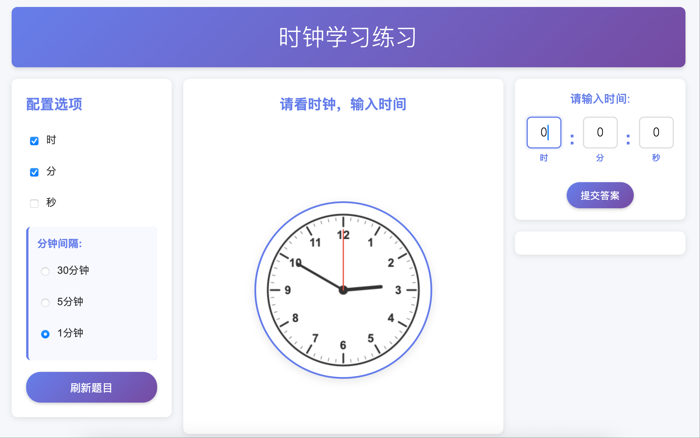

# 时钟学习应用 (Clock Learning App)

一个专为小学生设计的时钟学习工具，帮助学生练习读取模拟时钟的时间。

## 预览



## 功能特点

- 🕐 **模拟时钟显示**: 使用HTML5 Canvas绘制真实的模拟时钟
- ⚙️ **灵活配置**: 可以选择显示时、分、秒，以及分钟间隔（30分钟、5分钟、1分钟）
- 🎯 **智能出题**: 自动生成随机时间，避免重复题目
- ✅ **即时反馈**: 提交答案后立即显示正确或错误，并给出正确答案
- 📱 **响应式设计**: 支持桌面、平板和手机设备
- 🎨 **友好界面**: 简洁直观的设计，适合小学生使用

## 使用方法

1. 打开 `index.html` 文件
2. 在左侧配置面板选择要练习的时间单位（时、分、秒）
3. 如果选择了分钟，可以设置分钟间隔
4. 点击"刷新题目"生成新的时间
5. 观察中间的时钟，在右侧输入框中输入对应的时间
6. 点击"提交答案"查看结果
7. 点击"继续练习"进行下一题

## 技术实现

- **前端**: 原生HTML5、CSS3、JavaScript (ES6+)
- **时钟渲染**: HTML5 Canvas
- **布局**: CSS Grid + Flexbox
- **状态管理**: 简单的对象状态管理
- **本地存储**: localStorage保存用户配置

## 项目结构

```
clock-learning-app/
├── index.html              # 主页面
├── styles.css              # 样式文件
├── js/
│   ├── main.js             # 应用入口
│   ├── app-controller.js   # 应用控制器
│   ├── config-manager.js   # 配置管理
│   ├── time-generator.js   # 时间生成器
│   ├── clock-renderer.js   # 时钟渲染器
│   └── answer-validator.js # 答案验证器
└── README.md               # 项目说明
```

## 浏览器兼容性

- Chrome 60+
- Firefox 55+
- Safari 12+
- Edge 79+

## 开发说明

本项目使用原生JavaScript开发，无需构建工具，可直接在浏览器中运行。

### 核心类说明

- **ConfigManager**: 管理应用配置，支持本地存储
- **TimeGenerator**: 根据配置生成随机时间，避免重复
- **ClockRenderer**: 使用Canvas绘制模拟时钟，支持降级显示
- **AnswerValidator**: 验证用户输入的答案
- **AppController**: 协调各个组件，管理应用流程

## 教育价值

- 帮助小学生学习读取模拟时钟
- 支持渐进式学习（从整点到分钟到秒钟）
- 提供即时反馈，增强学习效果
- 随机出题，避免死记硬背

## 许可证

MIT License

## 作者

Created with ❤️ for elementary school students learning to read clocks.