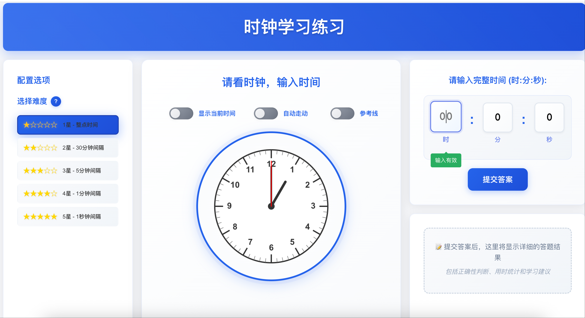
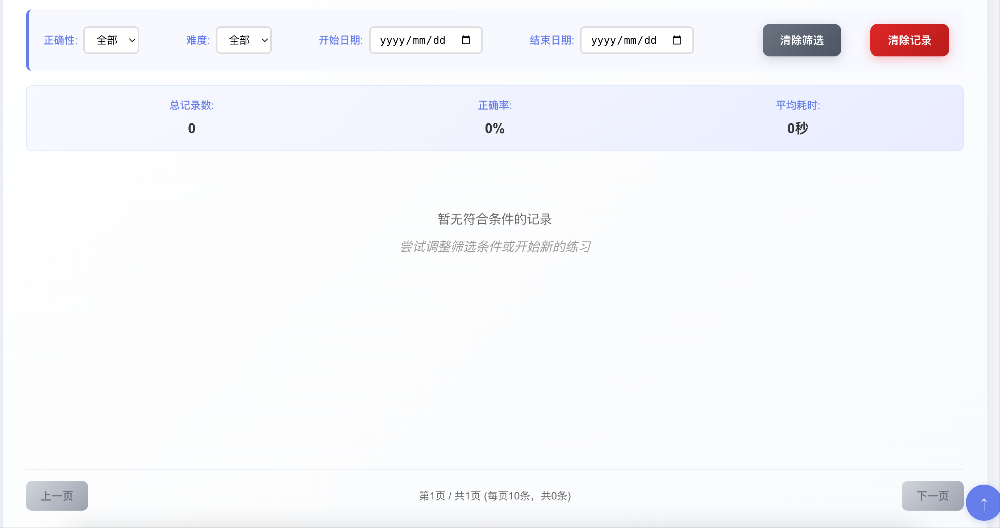

# 时钟学习应用 (Clock Learning App)

一个专为小学生设计的时钟学习工具，帮助学生练习读取模拟时钟的时间。采用现代化的星级难度系统，提供渐进式学习体验。

## 预览





## 核心功能特点

### 🌟 星级难度系统
- **1星 - 整点时间**: 显示整点时间（如 3:00:00），适合初学者
- **2星 - 30分钟间隔**: 显示半点时间（如 3:30:00），学习半点概念
- **3星 - 5分钟间隔**: 显示5分钟间隔时间（如 3:25:00），练习基础分钟读取
- **4星 - 1分钟间隔**: 显示1分钟间隔时间（如 3:27:00），掌握精确分钟
- **5星 - 包含秒数**: 显示完整时间包含秒数（如 3:27:45），挑战完整时间读取

### 🕐 高级时钟功能
- **Canvas时钟渲染**: 使用HTML5 Canvas绘制真实的模拟时钟
- **参考线辅助**: 可选显示指针参考线，帮助理解时针分针位置
- **自动走动模式**: 时钟可以实时走动，模拟真实时钟
- **当前时间显示**: 可切换显示当前真实时间
- **降级兼容**: 不支持Canvas的浏览器自动切换到数字时钟显示

### 📊 智能记录系统
- **答题历史**: 完整记录每次答题的详细信息
- **统计分析**: 显示正确率、平均答题时间等统计数据
- **多维筛选**: 支持按正确性、难度、日期范围筛选记录
- **数据持久化**: 使用Cookie存储，支持多种存储方案备用
- **分页浏览**: 大量记录时支持分页查看

### ⏱️ 精确计时功能
- **答题计时**: 精确记录每题的答题时间
- **实时显示**: 答题过程中实时显示已用时间
- **性能统计**: 分析答题速度变化趋势

### ♿ 无障碍支持
- **键盘导航**: 完整的Tab键导航支持
- **触摸优化**: 针对触摸设备的交互优化
- **焦点管理**: 清晰的焦点指示和管理
- **ARIA标签**: 完善的无障碍标签支持

### ⚡ 性能优化
- **渲染优化**: 智能缓存和批量更新减少重绘
- **内存管理**: 高效的内存使用和垃圾回收
- **响应式加载**: 按需加载和延迟初始化
- **错误恢复**: 完善的错误处理和自动恢复机制

## 使用方法

### 基础操作
1. 打开 `index.html` 文件或访问部署的网页
2. 在配置面板中选择难度等级（1-5星）
3. 观察时钟显示的时间
4. 在输入框中输入对应的时、分、秒
5. 点击"提交答案"查看结果
6. 查看答题记录和统计信息

### 高级功能
- **参考线**: 开启参考线辅助理解指针位置
- **自动走动**: 让时钟像真实时钟一样走动
- **当前时间**: 显示当前真实时间进行对比
- **记录筛选**: 按条件筛选查看历史答题记录
- **键盘操作**: 使用Tab键在界面元素间导航

## 技术架构

### 核心技术栈
- **前端框架**: 原生HTML5、CSS3、JavaScript (ES6+)
- **图形渲染**: HTML5 Canvas API
- **布局系统**: CSS Grid + Flexbox
- **数据存储**: Cookie + localStorage + sessionStorage (多重备用)
- **性能优化**: 渲染缓存、批量更新、防抖节流

### 架构设计
- **模块化设计**: 每个功能独立封装为类
- **事件驱动**: 组件间通过事件通信
- **错误恢复**: 多层级错误处理和自动恢复
- **渐进增强**: 核心功能优先，高级功能渐进增强

## 项目结构

```
learnClock/
├── index.html                    # 主页面
├── styles.css                    # 样式文件
├── image/                        # 图片资源
│   ├── image1.png               # 应用主界面截图
│   ├── image2.png               # 答题记录界面截图
│   └── view.png                 # 原始预览图
├── js/                          # JavaScript模块
│   ├── main.js                  # 应用入口和初始化
│   ├── app-controller.js        # 应用主控制器
│   ├── difficulty-manager.js    # 难度管理系统
│   ├── difficulty-ui.js         # 难度选择界面
│   ├── time-generator.js        # 智能时间生成器
│   ├── clock-renderer.js        # Canvas时钟渲染器
│   ├── timer-manager.js         # 计时功能管理
│   ├── answer-validator.js      # 答案验证器
│   ├── record-manager.js        # 答题记录管理
│   ├── record-ui.js             # 记录界面管理
│   ├── config-manager.js        # 配置管理器
│   ├── accessibility-manager.js # 无障碍功能管理
│   └── performance-optimizer.js # 性能优化器
├── test-guideline.html          # 测试指南
├── verify-fix.html              # 修复验证页面
└── README.md                    # 项目文档
```

## 浏览器兼容性

### 推荐浏览器
- **Chrome 60+**: 完整功能支持，最佳体验
- **Firefox 55+**: 完整功能支持
- **Safari 12+**: 完整功能支持
- **Edge 79+**: 完整功能支持

### 降级支持
- **旧版浏览器**: 自动切换到数字时钟模式
- **移动浏览器**: 触摸优化界面
- **无障碍设备**: 完整的键盘和屏幕阅读器支持

## 开发说明

### 快速开始
```bash
# 克隆项目
git clone [repository-url]

# 进入项目目录
cd learnClock

# 启动本地服务器
python3 -m http.server 8000
# 或使用其他静态服务器

# 访问应用
open http://localhost:8000
```

### 核心架构组件

#### 管理器类
- **AppController**: 应用主控制器，协调所有组件
- **DifficultyManager**: 星级难度系统管理
- **RecordManager**: 答题记录和数据持久化
- **TimerManager**: 精确计时功能
- **ConfigManager**: 用户配置管理
- **AccessibilityManager**: 无障碍功能支持
- **PerformanceOptimizer**: 性能优化和缓存

#### 界面组件
- **DifficultyUI**: 星级难度选择界面
- **RecordUI**: 答题记录显示和筛选
- **ClockRenderer**: Canvas时钟渲染器

#### 工具类
- **TimeGenerator**: 智能时间生成，避免重复
- **AnswerValidator**: 答案验证和评分

### 开发特性
- **模块化**: 每个功能独立模块，便于维护
- **类型安全**: 完整的参数验证和错误处理
- **性能优化**: 渲染缓存、防抖节流、内存管理
- **测试友好**: 内置测试模式和调试工具

## 教育价值

### 学习目标
- **基础认知**: 理解时钟的基本构造和指针含义
- **时间概念**: 建立小时、分钟、秒钟的时间概念
- **读取技能**: 掌握模拟时钟的读取方法
- **精确度训练**: 从整点到分钟再到秒钟的渐进训练

### 教学优势
- **渐进式学习**: 5个难度等级，循序渐进
- **即时反馈**: 立即显示答案正确性和详细解释
- **数据追踪**: 完整的学习进度和成绩记录
- **个性化**: 根据学习情况调整难度
- **趣味性**: 星级系统和成就感激励

### 适用场景
- **家庭教育**: 家长辅导孩子学习时间
- **课堂教学**: 教师课堂演示和练习
- **自主学习**: 学生独立练习和复习
- **特殊教育**: 无障碍支持，适合不同需求的学生

## 许可证

MIT License

## 作者

Created with ❤️ for elementary school students learning to read clocks.